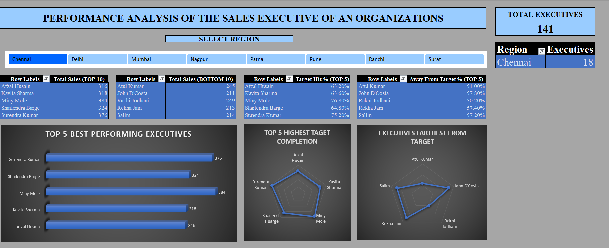

#  Sales Department Analysis

An interactive Excel dashboard project analyzing the performance of sales executives of the organizations from various regions across the nation.

---

##  Project Overview

Achieving the target is very important for any Sales Department. This Excel-based dashboard provides data-driven insights into the performance of the sales executives so that the organization can take neccesary steps to increse productivity and take actions against less productive executive emplyoees.

---

##  Features & Insights

-  **Interactive Dashboard** — Analyze churn using dynamic slicers and charts  
-  **Region-Specific Views** — Separate dashboards for seperate Regions 

---

## Tools & Techniques Used

- Microsoft Excel (.xlsm format)
- Pivot Tables & Pivot Charts
- Slicers & Filters
- Conditional Formatting & Heatmaps
- Formulas: `COUNTIF`, `AVERAGEIFS`, `COUNTA`, `IF`

---

## Getting Started

1. Clone or download this repository
2. Open `Telecom_Churn_Dashboard.xlsm` in Excel
3. Enable **macros** if prompted
4. Use slicers to explore churn patterns by:
   - Gender  
   - Age Group  
   - Subscription Type  

---

## Dashboard Preview

